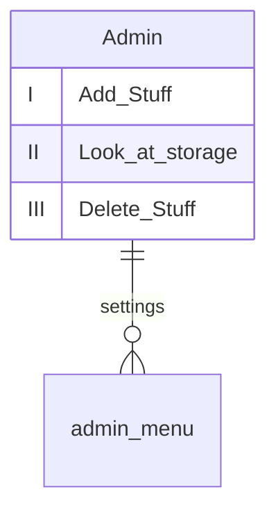

# CoffeeShop Menu :coffee:
****
### Даний проєкт є відтворенням меню самообслуговування, на прикладі кав'ярні.
## Проєкт будується на json файлах, з візуалізацію через Easygui.
### Присутній також функціонал для персоналу - не тільки для покупців.
****
>Створений разом з `WaRaN1` і `OneManuL` :busts_in_silhouette:
****
:books: Список бібліотек з їх версіями: 

| Бібліотеки| Версія | Команди|
|----------------|:---------:|----------------:|
| Os.path| default | import os.path|
| Random | default | import random |
| Json| default | import json|
| Time | default | import time |
| Easygui | 0.98.3 | from easygui import * |

>:eyes: Усі файли і папки мають бути в одній папці для коректної роботи коду :eyes:
****
# Початок роботи в коді :large_blue_diamond:
****
У проєкті є 2 основних файлa. ___CoffeeShopMenu___ i ___defs___.

>`CoffeeShopMenu` - це основний файл, який треба запускати самим першим і єдиним.

>`Defs` - це файл в якому записані усі функції, імпортувавши його у файл `CoffeeShopMenu` - ми зберегли більше місця і чистоту нашого мейна.

Запустивши програму перед вам буде вікно вибору:


Якщо ви нажмете на персонал - вас кине на авторизацію в системі адмін-панелі.

>У дефолтного юзера: `login` буде - 1111,а пароль - `1234`

# В меню персоналу - адміністратора ви можете:

 :white_check_mark: Додавати новий товар в файл складу.
 :white_check_mark: Перегляд складу/вашого активного меню.
 :white_check_mark: Видалення товару.
 
>В коді використані чотири `json` файла, які між собою зв'язані.\
>Для коректної роботи основного меню - у них додані дефолтні значення, дефолтні позиції в меню.\
>Ви завжди їх можете змінити на свої через адмін-панель.
****
# Логіка роботи коду :large_blue_diamond:
****
Натиснувши тут `Перейти до покупок` вас кине на меню самообслуговування.\


Першим діло - ваc запитають про картку лояльності/код на знижку.\
По дефолту ви можете ввести - `646165`.
>Як створюється цей код?\
За допомогою __Random__ - створюється унікальний код, з рандомних цифр, який записується в клієнтську базу під іменем, що ви вказали при реєстрації.\
На це ім'я і код будуть записуватись усі покупки клієнта, від чого і будуть нараховуватись знижки.

Систему знижок у файлі `defs` можна вільно міняти ось в цьому кусочку кода:
     
```Python
if str(clients_code) in file2:
                discount = file2.get(clients_code).get("Сума") / 500
                if discount > 20:
                    discount = 20
```

 Вказаний % знижки нараховується, якщо клієнт перейшов певний поріг витрат у вас. Цю кількість ми дізнаємось з файлу клієнтів по імені клієнта.
 
 Під унікальним кодом клієнта - створюється місце(__кошик__) для цього клієнта.\
 В любий момент користування меню - людина може зайти в кошик і видалити з нього товар, який вона не хоче купляти, або якщо побачить, що загальна сума покупок завелика для його гаманця
 ****
# Користування меню :large_blue_diamond:
****
На вибір є дві позиції для покупки - десерти, себто - `Смаколики` і `Кава`.\
Обираємо до прикладу `Каву`:
>Обираючи любий варіант - ви переходите до візуалізації json файлу меню.


\
З нього підтягується весь доступний товар, а кнопки в Easygui автоматично підбираються під варіанти покупок.\
Під час покупки ви можете вибрати кількість товару - програма автоматично буде звірятись з файлом складу, перевіряючи чи доступна така кількість товару для продажу.
****
# Покупка :large_blue_diamond:
****
В кінці вам покажеться фінальний чек і QR-code для онлайн оплати.
Якщо через 3хв оплата не пройде - вас викидає з вашого акаунта, очищається кошик і програмою можна користуватись заново.
